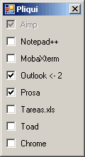

### ¿Casi siempre arrancas los mismos programas al iniciar sessión?

Si.

### Entonces, ¿Por qué no usas "tareas programadas" o metes accesos directos en "Inicio -> Programas -> Inicio"?

Porque se ejecutaría todo a la vez y me ralentiza mucho el inicio del ordenador.

Además, por muy frecuentemente que use esos programas el día que solo quiero encender el ordenador para otra cosa me fastidia enormemente tener que esperar a que se arranque todo y luego tener que cerrarlo todo otra vez.

# Entonces usa Pliqui

Pliqui es el único programa que necesitas poner en "tareas programadas" o en "inicio". Es ligero y no te ralentizara el ordenador.

Pliqui arrancara un programa detrás de otro en el orden que tu digas, esperando los minutos que tu quieras entre uno y otro para que no se lance todo a la vez y te dará el tiempo que tu quieras para modificar o abortar dicha lista antes de que sea tarde.

## Un ejemplo de uso de Pliqui

Fichero de configuración (config.xml):
```
#!xml

<xml wait="60">
	<app seg="05" nombre="Aimp" exe="C:\Archivos de programa\AIMP2\AIMP2.exe"/>
	<app min="01" nombre="Notepad++" iu="true" exe="C:\Archivos de programa\Notepad++\notepad++.exe"/>
	<app min="02" nombre="MobaXterm" iu="true" exe="C:\MobaXterm\MobaXterm_Personal_6.1.exe"/>
	<app min="04" nombre="Outlook" exe="C:\Archivos de programa\Microsoft Office\Office12\OUTLOOK.EXE" arg="/recycle"/>
	<app min="08" nombre="Prosa" exe="C:\Archivos de programa\IBM\SDP\eclipse.exe" arg="-product com.ibm.rational.rsa4ws.product.v75.ide"/>
	<app min="04" nombre="Tareas.xls" iu="true" dup="true" exe="C:\Archivos de programa\Microsoft Office\Office12\EXCEL.EXE" arg='/r /e "O:\RED\TAREAS.XLS"'/>
	<app min="09" nombre="Toad" iu="true" exe="C:\Archivos de programa\Quest Software\Toad for Oracle\toad.exe"/>
	<app 
		min="10" 
		nombre="Chrome" 
		iu="true"
		exe="C:\Documents and Settings\99GU5372\Config~1\Datos de programa\Google\Chrome\Application\chrome.exe" 
	/>
</xml>
```

Con wait="60" hago que Pliqui espere un minuto antes de empezar a iniciar programas. ¿Por qué? Porque si hoy tengo pensado usar el ordenador para otra cosa me de tiempo a cancelar o cambiar el plan de inicio antes de que empiece a abrirse todo.

Con cada tag "app" defino el programa que quiero que se abra (atributo "exe"), con que parámetros (atributo "arg") y cuando (atributo "seg" o "min")

Mi primer "app" es mi reproductor de musica favorito porque si no me he ido a tomar un café mientras se enciende el ordenador probablemente quiera escuchar algo de musica hasta que todo este listo ;)

El atributo iu="true" es para aquellos programas que quiero tener en mi listado de ejecución pero que quiero que aparezcan inicialmente desmarcados, es decir, que no se arranquen por defecto.

Además Pliqui antes de arrancar un programa mirara si este ya esta abierto (puede que hayamos sido impacientes y ya lo hayamos abierto nosotros manualmente) para no volverlo a ejecutar innecesariamente.

Por eso algunos programas tiene definido el atributo dup="true" para avisar que se ignore lo dicho en el parrafo anterior. ¿Por qué? Porque (como en el ejemplo) aunque EXCEL.EXE ya este arrancado eso no significa que no quera abrir mi excel tareas.xsl

El resultado es el siguiente:



Los programas con el "check" marcado son aquellos que se van a iniciar.

Los programas que aparecen deshabilitados son los que ya están arrancados.

El programa cuyo nombre viene señalado por "<-" es el siguiente que va a ser ejecutado (el 2 que aparece indica que sera el 2º programa en ser ejecutado).

# Descargar

Puedes bajarte un binario y xml de ejemplo de la carpeta "bin" del repositorio.
